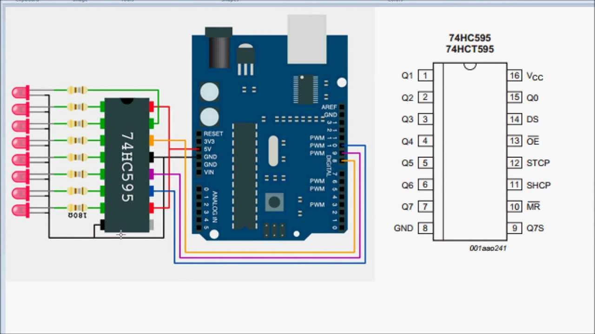
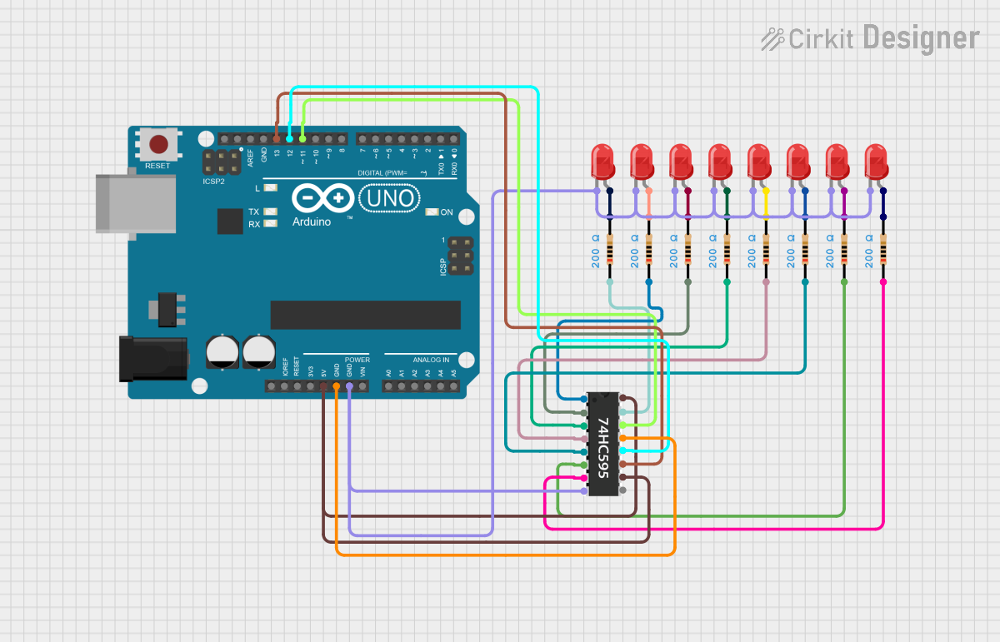

# Documentation technique — Piano Diatonique

Référence du programme pour qui veut comprendre le code, le modifier ou reproduire le montage : architecture logicielle, brochage détaillé et structures de données.

## 1. Vue d'ensemble

Sketch Arduino unique (`piano_diatonique.ino`), structuré autour d'une machine à états simple (`AppState`) exécutée dans `loop()`. Chaque mode est une fonction bloquante appelée depuis `loop()`, qui ne rend la main qu'au retour au menu (geste "retour" ou fin de séquence).

```
                ┌────────────┐
        ┌──────▶│    MENU    │◀──────┐
        │       └─────┬──────┘       │
        │     bouton1 │ bouton2 │ bouton3
        │             ▼         ▼         ▼
        │       ┌──────────┐┌────────┐┌──────────┐
        │       │  PIANO   ││  JEU   ││  SONS    │
        │       └────┬─────┘└───┬────┘└────┬─────┘
        │            │          │          │
        └────────────┴──────────┴──────────┘
           appui long bouton 8 (retour) ou fin de mode
```

## 2. Brochage complet

| Fonction | Broche Arduino | Notes |
|---|---|---|
| Bouton 1 (Do) | D2 | `INPUT_PULLUP`, actif à l'état bas |
| Bouton 2 (Ré) | D3 | idem |
| Bouton 3 (Mi) | D4 | idem |
| Bouton 4 (Fa) | D5 | idem — double comme pause/reprise musique de fond au menu |
| Bouton 5 (Sol) | D6 | idem |
| Bouton 6 (La) | D7 | idem |
| Bouton 7 (Si) | D8 | idem |
| Bouton 8 (Do aigu) | D9 | idem — double comme geste "retour" en appui long |
| Buzzer | D10 | `tone()` / `noTone()` |
| 74HC595 — SER (données) | D11 | broche 14 du 74HC595 |
| 74HC595 — RCLK (verrou) | D12 | broche 12 du 74HC595 |
| 74HC595 — SRCLK (horloge) | D13 | broche 11 du 74HC595 |
| Potentiomètre (curseur) | A1 | extrémités sur 5V / GND |
| A0 | — | libre, utilisée uniquement comme source de bruit pour `randomSeed()` |
| LCD I2C — SDA | A4 | bus I2C matériel |
| LCD I2C — SCL | A5 | bus I2C matériel |

### 74HC595 → LED

| 74HC595 | Rôle | Connexion |
|---|---|---|
| Q0 … Q7 (broches 15, 1-7) | Sorties | Une LED chacune (+ résistance 220-330 Ω) → GND, dans le même ordre que les boutons |
| VCC (16) | Alimentation | 5V |
| GND (8) | Masse | GND |
| MR (10, reset) | Reset (actif bas) | 5V (jamais reseté) |
| OE (13, output enable) | Activation sorties (actif bas) | GND (toujours actif) |

### Schéma de câblage

| Brochage du 74HC595 | Câblage complet (Arduino → 74HC595 → LED) |
|---|---|
|  |  |

## 3. Bibliothèques utilisées

- **LiquidCrystal_I2C** (Frank de Brabander) — [github.com/fdebrabander/Arduino-LiquidCrystal-I2C-library](https://github.com/fdebrabander/Arduino-LiquidCrystal-I2C-library). ⚠️ Plusieurs bibliothèques portent ce nom avec des API différentes (`init()` vs `begin()` avec ou sans arguments) ; se référer au header réellement installé en cas d'erreur de compilation.
- **Wire** — bus I2C, fournie avec l'IDE Arduino.
- **math.h** — `pow()` et `round()` pour le calcul des fréquences transposées.

## 4. Structures de données clés

### 4.1 `MelodyStep`

```cpp
struct MelodyStep { int8_t degree; uint16_t ms; };
```

Représente une note d'une mélodie précalculée : `degree` est un degré de gamme étendu (voir §5), `ms` sa durée en millisecondes. Sentinelle de fin de tableau : `{99, 0}` (`degree == 99`). Un `degree` négatif est réservé pour un silence (non utilisé actuellement, mais géré par `playSong()`).

Cette structure sert à la fois aux mélodies préchargées (`SONG1`/`SONG2`/`SONG3`, tableaux `const`) et à la musique de fond (`BG_MUSIC`).

**Piège Arduino évité** : `MelodyStep` est déclaré tout en haut du fichier, juste après les `#include`. L'IDE Arduino génère automatiquement des prototypes de fonctions et les insère à cet endroit précis, avant le reste du code — un type utilisé dans une signature de fonction (ici `playSong(const MelodyStep*)`) doit donc déjà être défini à ce point du fichier, sous peine d'un `'MelodyStep' does not name a type`.

### 4.2 Enregistrements utilisateur (mode Sons)

```cpp
#define MAX_SLOTS 3
#define MAX_STEPS 30
int8_t  recDegree[MAX_SLOTS][MAX_STEPS];
uint8_t recDurationTicks[MAX_SLOTS][MAX_STEPS]; // unité = 20 ms
uint8_t recLength[MAX_SLOTS];
```

Chaque emplacement mémorise jusqu'à 30 notes, avec la durée écoulée depuis la note précédente quantifiée par pas de 20 ms sur un `uint8_t` (jusqu'à 5,1 s par note). Stockage en RAM uniquement (perdu à la coupure d'alimentation — voir pistes d'évolution dans le dossier de conception).

## 5. Système de fréquences multi-octave

```cpp
const uint16_t BASE_FREQ[7] = {523, 587, 659, 698, 784, 880, 988}; // Do5..Si5

uint16_t baseFrequency(uint8_t degree) {
  uint8_t idx = degree % 7;
  uint8_t octave = degree / 7;
  uint16_t f = BASE_FREQ[idx];
  for (uint8_t o = 0; o < octave; o++) f *= 2;
  return f;
}
```

`BASE_FREQ` ne stocke que les 7 notes uniques d'une octave (Do à Si). `baseFrequency(degree)` généralise à un `degree` quelconque : `degree % 7` donne la note dans la gamme, `degree / 7` le nombre d'octaves à monter (fréquence doublée par octave). Ainsi `degree = 0..6` couvre l'octave de base, `degree = 7` est le Do aigu (identique au bouton 8), `degree = 8..13` couvre l'octave suivante, etc.

Cette extension a été nécessaire car certaines mélodies (Joyeux Anniversaire) dépassent une octave — l'instrument physique (8 boutons) n'y accède pas directement, mais le buzzer peut jouer n'importe quel `degree`. Dans `playNote()`, l'allumage de LED (`ledOnly(degree)`) n'a d'effet que pour `degree < 8` (les autres valeurs éteignent simplement les LED, cf. `ledOnly()` §6).

`transposedFrequency(degree, shift)` réutilise `baseFrequency()` et applique un décalage en demi-tons (`shift`, positif ou négatif) via la formule d'accordage égal : `f' = f × 2^(shift/12)`. Utilisée uniquement en mode Piano, pilotée par le potentiomètre (`keySemitones`, -6 à +6).

## 6. Gestion des LED (74HC595)

```cpp
uint8_t ledState = 0;
void writeLeds() {
  digitalWrite(LED_LATCH_PIN, LOW);
  shiftOut(LED_DATA_PIN, LED_CLOCK_PIN, MSBFIRST, ledState);
  digitalWrite(LED_LATCH_PIN, HIGH);
}
```

Un seul octet (`ledState`) représente l'état des 8 LED ; `shiftOut()` le transmet bit à bit sur `LED_DATA_PIN`, cadencé par `LED_CLOCK_PIN`, puis `LED_LATCH_PIN` bascule pour appliquer le nouvel état en sortie. `ledOnly(i)` n'allume qu'une seule LED à la fois (usage le plus courant : une note = une LED), avec protection `i < 8` (sinon toutes les LED sont éteintes, cas des degrés étendus > 7).

## 7. Lecture des boutons et geste "retour"

```cpp
int readButtonBlocking(unsigned long timeoutMs);
// retour : 0..7 = bouton pressé brièvement
//          -1   = timeout écoulé sans appui (timeoutMs == 0 → attente infinie)
//          -2   = appui long (≥ 1200 ms) sur le bouton 8 (BACK_BTN_INDEX)
```

Fonction bloquante centrale, utilisée par tous les modes. Anti-rebond simple par re-lecture après `DEBOUNCE_MS` (20 ms). Le geste "retour" est détecté en mesurant la durée d'appui du bouton 8 dans la boucle de scrutation ; ce mécanisme est indépendant du `timeoutMs` demandé (un appui long peut donc dépasser légèrement le timeout initial, sans conséquence pratique).

Ce choix (une seule fonction de lecture bouton, réutilisée partout avec un geste "retour" cohérent) simplifie fortement la navigation sans bouton dédié — voir la justification dans le [dossier de conception](doc-conceptuel.md#35-pourquoi-réutiliser-les-boutons-de-notes-pour-naviguer-les-menus-plutôt-quajouter-des-boutons-dédiés).

## 8. Musique de fond non bloquante

`tone(pin, freq, duree)` sur Arduino programme un minuteur matériel et **rend la main immédiatement** : le programme continue de s'exécuter pendant que le son joue. `playBgNoteAndListen()` exploite cette propriété : il déclenche la note puis appelle `readButtonBlocking(durationMs)`, qui scrute les boutons pendant exactement la durée de la note — le son et la détection d'appui sont ainsi simultanés, sans latence perceptible à l'appui.

`waitForButtonWithMusic()` boucle sur le tableau `BG_MUSIC` tant qu'aucun bouton de mode (1/2/3) n'est pressé. Le bouton 4 bascule un drapeau global `bgMusicOn` (pause/reprise) sans interrompre l'attente : à l'arrêt, la fonction scrute les boutons en silence (`readButtonBlocking(300)` par tranches de 300 ms) plutôt que de bloquer indéfiniment, pour rester réactive à une reprise.

## 9. Adaptation automatique à la taille de l'écran

`LCD_ROWS`/`LCD_COLS` (configurables en tête de fichier) pilotent deux familles d'affichage :

- `showMessage(l1, l2, l3, l4)` : affiche systématiquement les 2 premières lignes ; les lignes 3 et 4 ne sont utilisées que si `LCD_ROWS >= 4`.
- Les écrans à fort contenu (menu principal, sous-menu Sons) ont chacun une variante dédiée pour 2 lignes (texte condensé) et une pour 4 lignes, sélectionnée par un test `if (LCD_ROWS >= 4)`.

Ce choix évite l'écueil rencontré en développement : un texte pensé pour 4 lignes et silencieusement tronqué à 2 lignes fait disparaître des options du menu sans erreur visible.

## 10. Budget mémoire (Arduino Uno, IDE 1.8.19)

Dernière compilation connue (avant l'ajout de la musique de fond) :

```
Flash : 13 370 / 32 256 octets (41 %)
RAM   : 1 311 / 2 048 octets (64 %) — 737 octets libres pour les variables locales
```

Les tableaux d'enregistrement (`recDegree`, `recDurationTicks` : 3 × 30 × 2 octets = 180 octets) et les mélodies précalculées sont les principaux postes de RAM. Aucune optimisation `PROGMEM` n'a été appliquée (marge jugée suffisante) ; si de nouvelles fonctionnalités RAM-intensives sont ajoutées, déplacer les tableaux `const` (mélodies, noms) en flash via `PROGMEM` est la première piste à envisager.

## 11. Diagnostic

`i2c_scanner.ino` (sketch indépendant) liste les adresses I2C répondant sur le bus — à utiliser en cas d'écran LCD muet, avant de suspecter le câblage ou le contraste.

## 12. Référence rapide des fonctions

| Fonction | Rôle |
|---|---|
| `readButtonBlocking(timeoutMs)` | Lecture bouton bloquante + geste retour |
| `baseFrequency(degree)` / `transposedFrequency(degree, shift)` | Calcul de fréquence (multi-octave / transposée) |
| `playNote(degree, ms, freq, light)` | Joue une note (son + LED) |
| `playSuccessJingle()` / `playFailSound()` / `playVictoryJingle()` | Jingles du mode Jeu |
| `writeLeds()` / `ledOnly(i)` / `ledsAllOff()` | Pilotage bas niveau du 74HC595 |
| `showMessage(...)` / `showPianoScreen(...)` / `showMenu()` | Affichage LCD adaptatif |
| `modePiano()` / `modeGame()` / `modeSounds()` | Boucles principales des 3 modes |
| `generateSequence()` / `playSequence()` / `playerReproduce()` | Logique du Simon musical |
| `playSong()` / `playAllSongs()` | Lecture du jukebox préchargé |
| `recordNewSound()` / `playRecordedSlot()` / `playAllRecorded()` | Enregistrement et lecture des mélodies utilisateur |
| `waitForButtonWithMusic()` / `playBgNoteAndListen()` | Musique de fond non bloquante au menu |
